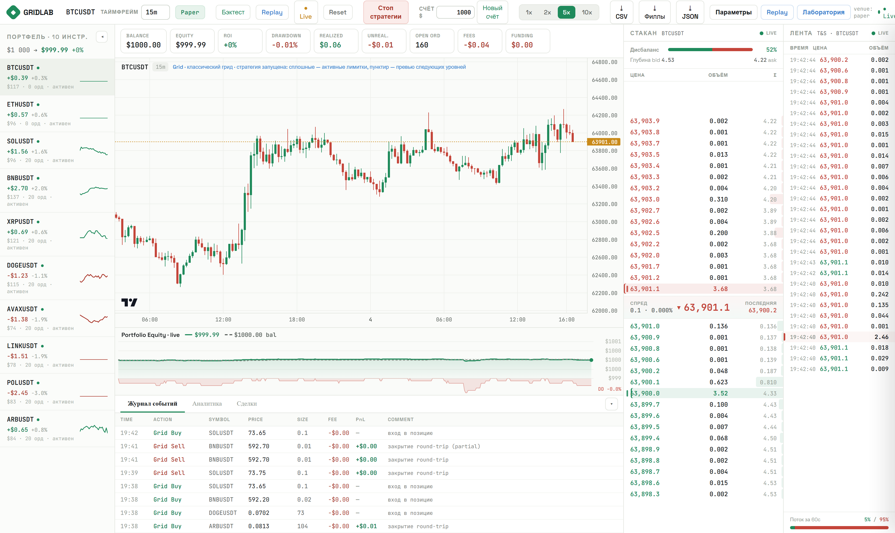
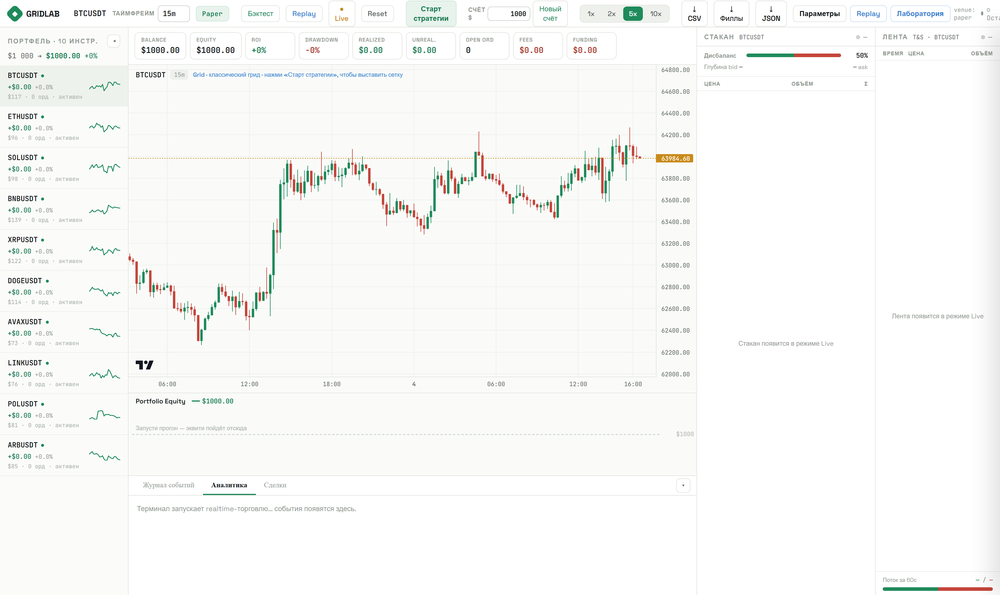
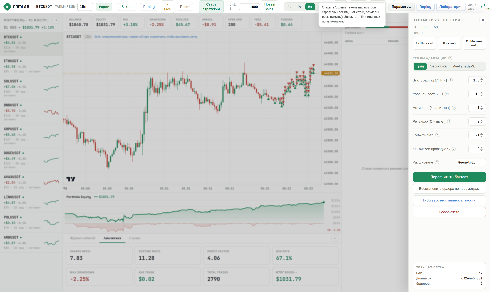

# GRIDLAB — исследовательский терминал адаптивной grid-стратегии

Лаборатория для проверки одной гипотезы: **есть ли альфа в адаптивном гриде на крипто-перпах
после честного учёта издержек.** Не торговый бот — инструмент, который даёт по этому вопросу
число, а не ощущение.

Одна стратегия разворачивается на корзину из 10 perpetual-инструментов Bybit, $1000
распределены risk-parity. Реальные свечи и стакан, полная модель издержек: maker/taker,
слиппедж, funding, маржа, ликвидация, задержка, позиция в очереди лимитника.

[](https://codespaces.new/anymasoft/gridlab-terminal)

Кнопка выше поднимает готовое окружение прямо в браузере: контейнер соберётся сам,
зависимости встанут автоматически. Дальше — одна команда в терминале:

```bash
python run.py
```

Порт 8100 проброшен заранее, поэтому превью с терминалом откроется само.
Ничего ставить локально не нужно. Сборка занимает 3–4 минуты.

**Запускается без единого ключа** — на публичных данных Bybit v5. Ключи нужны только
для режима Testnet.



---

## Что уже показала лаборатория

Прогон на дефолтных параметрах по всей корзине, 1000 баров × 10 инструментов:

| Метрика | Значение |
|---|---|
| Итог | $1000 → **$221.62** (−77.8%) |
| Сделок | 8 888 |
| Win rate | 37.3% |
| Profit factor | 0.21 |
| Средняя сделка | −$0.07 |
| Комиссии | −$147.82 |
| Max drawdown | −77.8% |



Это не поломка, а ответ. Сетка переторговывает: 8 888 сделок при средней −$0.07 и
комиссиях в 15% стартового капитала. Ликвидаций нет, движок отработал корректно — просто
на этих параметрах математического ожидания нет.

Ровно для этого в терминале есть **k-Sweep** и **Лаборатория**: перебор параметров,
heatmap и walk-forward, чтобы искать область, где ожидание положительное — и проверять,
что найденный параметр не подогнан под один инструмент.

Отрицательный результат, полученный честно, стоит дороже красивой кривой, полученной
подгонкой. Терминал построен так, чтобы врать было тяжело.

---

## Запуск

Нужен Python 3.11+.

```bash
git clone https://github.com/anymasoft/gridlab-terminal.git
cd gridlab-terminal
python -m venv .venv
```

Windows:
```bash
.venv\Scripts\python -m pip install -r requirements.txt
.venv\Scripts\python run.py
```

macOS / Linux:
```bash
.venv/bin/python -m pip install -r requirements.txt
.venv/bin/python run.py
```

Откройте **http://localhost:8100**. Конфигурация не обязательна: без `.env` терминал
поднимется на дефолтах (paper, BTCUSDT, 15m). Для полной корзины скопируйте
`.env.example` в `.env`.

Порт занят — `PORT=8110 python run.py`.

---

## Как пользоваться

| Действие | Что происходит |
|---|---|
| **Бэктест** | Прогон всей корзины на исторических свечах. Метрики появляются во вкладке «Аналитика». |
| **Старт стратегии** | Выставляет сетку лимиток по текущим параметрам. |
| **● Live** | Бумажный режим: свечи и стакан Bybit идут реалтайм, сетка исполняется по очереди в стакане. |
| **Replay** | Проигрывает инструмент по барам с ускорением 1x–10x. |
| **Параметры → Применить** | Пересчёт всего портфеля без перезагрузки. |
| **k-Sweep** | Перебор шага сетки на инструменте. Совпадает ли лучший k на разных инструментах — защита от оверфита. |
| **Лаборатория** | Оптимизатор: одиночный прогон, sweep, heatmap, walk-forward. |
| **⤓ CSV / Филлы / JSON** | Выгрузка сделок, исполнений и полного прогона. |



---

## Что внутри

### Два режима квотирования

**Эвристический грид** — сетка с шагом от ATR, геометрическое / арифметическое /
фибоначчи расширение, EMA-фильтр тренда, ограничение числа ордеров, kill-switch по просадке.

**Avellaneda–Stoikov** — каноническая реализация модели маркет-мейкинга: резервная цена
смещается от инвентаря, оптимальный спред зависит от γ (риск-аверсия), κ (интенсивность
потока) и горизонта. Живёт в `app/strategy/avellaneda_canonical.py`, покрыта отдельными
тестами.

Переключение — тумблером в панели параметров, без перезапуска.

### Честная модель издержек

Именно она отличает лабораторию от рисовалки красивых кривых:

- **maker/taker** раздельно, из конфига;
- **слиппедж** и **задержка** (250 мс по умолчанию) — заявка попадает в стакан не мгновенно;
- **позиция в очереди** — `app/engine/queue_fill.py` моделирует, сколько объёма стоит
  перед вашей лимиткой на уровне, и исполняет её только когда очередь дошла. Без этого
  бэктест грида систематически завышает результат;
- **частичное исполнение** — заявка может исполниться не целиком;
- **funding** по фактической истории ставок Bybit;
- **маржа и ликвидация** при плече (3x по умолчанию).

### Источники данных

- **Bybit v5** — свечи, funding, стакан. Keyless для публичных данных, переключение
  на testnet через `.env`.
- **Локальные тиковые данные** — `app/marketdata/localdata.py` и `app/engine/futures.py`
  читают тиковые выгрузки фьючерсов MOEX и FX для реплея на своей истории.
- **Архив стакана** — `app/marketdata/archive.py` пишет снимки стакана на диск,
  чтобы потом воспроизводить микроструктуру.

### Структура

```
run.py                      Точка входа, порт 8100
app/
├─ main.py                  FastAPI: SPA + REST + WebSocket
├─ config.py                Конфиг из .env
├─ models.py                Candle, GridParams, Order, Fill, Position
├─ marketdata/
│  ├─ bybit.py              Свечи, funding, стакан Bybit v5
│  ├─ orderbook.py          Живой стакан, дисбаланс, глубина
│  ├─ archive.py            Запись и воспроизведение снимков стакана
│  └─ localdata.py          Тиковые выгрузки MOEX / FX
├─ strategy/
│  ├─ indicators.py         ATR, EMA, σ — инкрементальные
│  ├─ quoting.py            Эвристический грид
│  ├─ avellaneda_canonical.py   Каноническая A-S
│  └─ quoter.py             Единый интерфейс над обоими режимами
├─ engine/
│  ├─ costmodel.py          maker/taker/slippage/funding/маржа
│  ├─ queue_fill.py         Позиция в очереди стакана
│  ├─ paper.py              Матчинг, частичное исполнение, ликвидация, PnL
│  ├─ venue.py              PaperVenue ↔ BybitTestnetVenue
│  ├─ realtime.py           Live-цикл
│  ├─ replay.py             Реплей по барам
│  ├─ futures.py            Фьючерсная специфика (ГО, шаг цены)
│  └─ session.py            Состояние сессии, персист в JSON
├─ backtest/
│  ├─ lab.py                Одиночный прогон, sweep, heatmap
│  └─ optimizer.py          Скоринг результатов, walk-forward
├─ portfolio/manager.py     10 инструментов, risk-parity, агрегат эквити
├─ analytics/metrics.py     Sharpe, Sortino, PF, win-rate, maxDD
└─ storage.py               SQLite + экспорт CSV/JSON
web/                        SPA: index.html · app.js · lab · replay
```

~5 500 строк Python, ~2 000 строк фронтенда без фреймворков.

---

## Тесты

```bash
.venv\Scripts\python -m pytest -q
```

```
67 passed in 0.62s
```

Покрыто то, где ошибка тихая и дорогая:

| Файл | Что проверяет |
|---|---|
| `test_queue_fill.py` | Очередь в стакане: заявка не исполняется раньше, чем до неё дошла очередь |
| `test_avellaneda_canonical.py` | Соответствие формулам A–S: смещение от инвентаря, зависимость спреда от γ и κ |
| `test_orderbook.py` | Сборка стакана, дисбаланс, глубина |
| `test_recentering.py` | Перецентровка сетки при уходе цены |
| `test_risk.py` | Маржа, ликвидация, kill-switch |
| `test_parity_cadence.py` | Паритет бэктеста и live: один и тот же вход даёт один и тот же выход |
| `test_mm_metrics.py` | Метрики маркет-мейкинга |
| `test_quoter_unify.py` | Единый интерфейс над двумя режимами квотирования |
| `test_archive.py` | Запись и чтение архива стакана |
| `test_live_export.py` | Выгрузка live-сессии |

Самый важный здесь — `test_parity_cadence.py`. Если бэктест и live расходятся, все
остальные цифры бессмысленны.

---

## Конфигурация

Всё через `.env`, ключи не в коде. Полный список — в `.env.example`.

| Переменная | Назначение |
|---|---|
| `VENUE` | `paper` (по умолчанию) или `testnet` |
| `DEFAULT_SYMBOLS` | Корзина инструментов через запятую |
| `START_CAPITAL` | Стартовый капитал, распределяется risk-parity |
| `DEFAULT_INTERVAL`, `HISTORY_BARS` | Таймфрейм и глубина истории |
| `MAKER_FEE_BPS`, `TAKER_FEE_BPS`, `SLIPPAGE_BPS` | Модель издержек |
| `LEVERAGE`, `LIQ_MAINT_MARGIN_BPS`, `FUNDING_INTERVAL_H` | Плечо, ликвидация, funding |
| `LATENCY_MS` | Задержка до попадания заявки в стакан |
| `BYBIT_TESTNET_API_KEY` / `_SECRET` | Только для `VENUE=testnet` |

---

## Границы и честные оговорки

- **Это бумажный счёт.** Реальными деньгами ничего не торгуется, ордера на биржу
  не уходят (кроме явного режима testnet).
- **Дефолтные параметры убыточны** — см. таблицу выше. Терминал существует, чтобы
  искать параметры, а не чтобы демонстрировать прибыль.
- **Бумажный матчинг всегда оптимистичнее реальности.** Очередь и задержка смоделированы,
  но не воспроизводят биржу в точности.
- **Отбор параметров по прошлому не переносится на будущее сам собой.** Для этого
  в лаборатории есть walk-forward и сравнение лучшего k между инструментами.
- Состояние сессии лежит в `data/gridlab_session.json`. Кнопка **«Новый счёт»**
  сбрасывает эквити; при смене состава корзины сброс обязателен, иначе метрики
  смешивают старую и новую аллокацию.

## Известные шероховатости

- На графике в режиме бэктеста ось времени рендерится от нулевой отметки Unix
  (`01 янв. '70`) — в прогон передаются индексы баров вместо таймстампов. На расчёты
  не влияет, но глаз цепляет.

---

## Стек

Python 3.11+ · FastAPI · uvicorn · httpx · pydantic v2 · websockets · SQLite ·
Canvas-графики без фронтенд-фреймворков.
